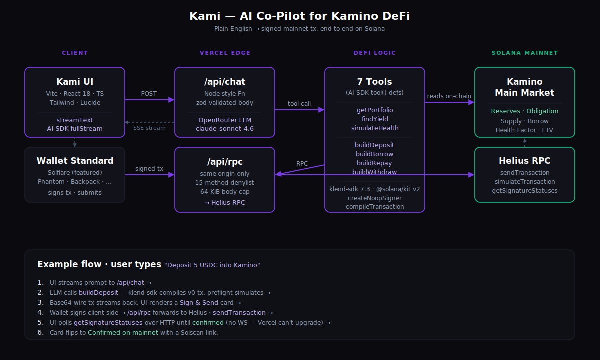

# Kami — AI Co-Pilot for Kamino DeFi on Solana

Chat-driven assistant for Kamino Finance. Ask in plain English — *"best USDC yield on Kamino"*, *"deposit 100 USDC"*, *"will this borrow liquidate me?"* — and Kami streams a natural-language answer plus, when relevant, a ready-to-sign mainnet transaction.

**Live:** [kami.rectorspace.com](https://kami.rectorspace.com)  ·  **Bounty:** [Eitherway Track — Frontier Hackathon 2026](https://superteam.fun/earn/listing/build-a-live-dapp-with-solflare-kamino-dflow-or-quicknode-with-eitherway-app)

## Proof of Life

Deposited live on mainnet through the deployed UI:

- **Tx:** [`5XKeETjGfmj9jEWUNCKcf8u49bY4hEzX2a7JcB4nPxQCBbmZ7ipoNrgTXQMJWXHvKw7Bsera9xxYygLVxLUpUvZE`](https://solscan.io/tx/5XKeETjGfmj9jEWUNCKcf8u49bY4hEzX2a7JcB4nPxQCBbmZ7ipoNrgTXQMJWXHvKw7Bsera9xxYygLVxLUpUvZE)
- **Action:** 0.5 USDC supplied to Kamino Main Market at ~5.09% APY
- **Flow:** typed *"Deposit 0.5 USDC into Kamino main market"* → LLM called `findYield` + `buildDeposit` → signed in wallet → on-chain confirmed via client-side polling

The full deposit → repay (with `NetValueRemainingTooSmall` auto-recovery) → withdraw round-trip was validated on 2026-04-24 — three archived signatures in [`docs/kamino-integration.md`](./docs/kamino-integration.md#hero-moment--llm-auto-recovery-from-kaminos-dust-floor).

## Status

- **106 vitest tests** across 10 files — handlers, guards, ratelimit, kamino helpers, ErrorBoundary
- **CI on every push:** typecheck (client + server) → tests → build → klend-sdk major-pin guard
- **Continuous deployment** via Vercel from `main`; security headers + rate-limit verified post-deploy
- **Rate-limit live:** 30/min on `/api/chat`, 120/min on `/api/rpc`, self-hosted Redis behind a Cloudflare tunnel; fail-open on backend outage so a Redis blip never 500s the app
- **Top-level React error boundary** catches uncaught render errors with a recovery panel
- **Uptime heartbeat:** scheduled GitHub Actions workflow pings the Redis backend every 15 minutes

## Features

### Read-only tools (no signing)

| Tool | Purpose |
|------|---------|
| `getPortfolio` | Connected wallet's live Kamino position: deposits, borrows, APYs, LTV, health factor |
| `findYield` | Top reserves by live supply / borrow APY, filterable by symbol |
| `simulateHealth` | Project the user's health factor after a hypothetical deposit/borrow/withdraw/repay |

### Write actions (produce a signable transaction)

`buildDeposit` · `buildBorrow` · `buildWithdraw` · `buildRepay`

Each builds an unsigned v0 transaction server-side (fresh blockhash, proper compute budget, all required account inits for first-time users), then returns it as base64 wire bytes. The UI renders a **Sign & Send** card with the exact action/amount/protocol; the user signs with their wallet, the client submits, and on-chain confirmation is polled over HTTP until `confirmed` or blockhash expiry.

**Preflight built-in:** every `build*` tool runs `simulateTransaction` before returning. If the wallet is short on SOL for account rent, Kami surfaces a precise shortfall — *before* the user burns a failed-tx fee.

## Kamino Integration

Kami is a deep Kamino integration, not a surface-level wrapper. Each of the seven tools maps one-to-one to a `@kamino-finance/klend-sdk` primitive; the LLM's system prompt encodes Kamino domain knowledge (klend / multiply / kliquidity / Scope, main-market address, health-factor semantics, dust-floor behaviour); and the LLM auto-recovers from Kamino-specific edge cases like `NetValueRemainingTooSmall` during close-out flows.

Full tool-by-tool SDK primitive mapping, architecture walkthrough, and live-validated mainnet signatures in **[docs/kamino-integration.md](./docs/kamino-integration.md)**.

## Architecture

<p align="center">
  
</p>

- **Frontend** — Vite + React 18 + TypeScript + Tailwind. Featured wallet: [Solflare](https://solflare.com/) via `@solana/wallet-adapter-solflare` (unified extension / web / mobile fallback). Any Solana-wallet-standard wallet also works (Phantom, Backpack, etc.) — the "Use another wallet" option lists everything detected.
- **Chat backend** — `server/chat.ts` exports a Web `ReadableStream` powered by Vercel AI SDK `streamText` + `fullStream`. Consumed by Fastify in local dev (`server/index.ts`) and a Node-style Vercel Function in production (`api/chat.ts`). **One source of truth for tool wiring.**
- **RPC** — Same-origin `/api/rpc` Vercel Function proxies JSON-RPC to Helius server-side. Keeps the key off the browser, avoids CORS, and sidesteps new-domain reputation issues.
- **LLM** — `anthropic/claude-sonnet-4.6` via OpenRouter. Swappable via `KAMI_MODEL`.
- **DeFi** — [`@kamino-finance/klend-sdk`](https://github.com/Kamino-Finance/klend-sdk) 7.3 on [`@solana/kit`](https://github.com/anza-xyz/kit) v2, against the Kamino Main Market.
- **Transaction build** — `createNoopSigner` + `compileTransaction` + `getBase64EncodedWireTransaction`. The wallet signs on the client; the server never holds a secret key.
- **Confirmation** — HTTP polling over `getSignatureStatuses` + `getBlockHeight` (Vercel Functions can't upgrade WebSockets, so the default subscription-based `confirmTransaction` would hang).

## Run locally

```bash
pnpm install
cp .env.example .env.local   # fill KAMI_OPENROUTER_API_KEY + SOLANA_RPC_URL
pnpm dev                     # web :5173 + api :3001 concurrently
```

## Scripts

- `pnpm dev` — web + api concurrently
- `pnpm dev:web` — Vite frontend only
- `pnpm dev:api` — Fastify backend only (tsx watch)
- `pnpm build` — production bundle (`tsc -b && vite build`)
- `pnpm exec tsc -p server/tsconfig.json --noEmit` — typecheck the server + `api/*.ts` Vercel Functions

## Deployment

- Vercel project `rectors-projects/kami`, auto-deploys from `main`.
- Production env vars: `KAMI_OPENROUTER_API_KEY`, `KAMI_MODEL`, `SOLANA_RPC_URL`.
- Custom domain `kami.rectorspace.com` served from Vercel with auto-renewed SSL (Cloudflare DNS-only).

## Origin

Initial scaffold generated by [Eitherway](https://eitherway.ai/) on 2026-04-19 (tagged `eitherway-v0`). Everything after is custom: Fastify + Vercel Function backends, Kamino SDK integration, the seven-tool suite, same-origin RPC proxy, preflight simulation, Sign & Send card, and the polling-based confirmation path.
